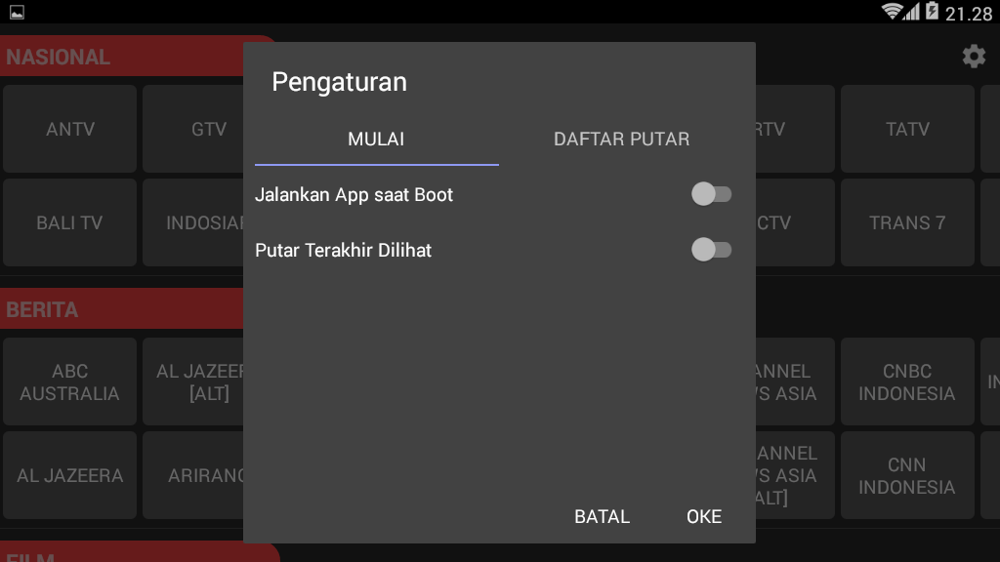
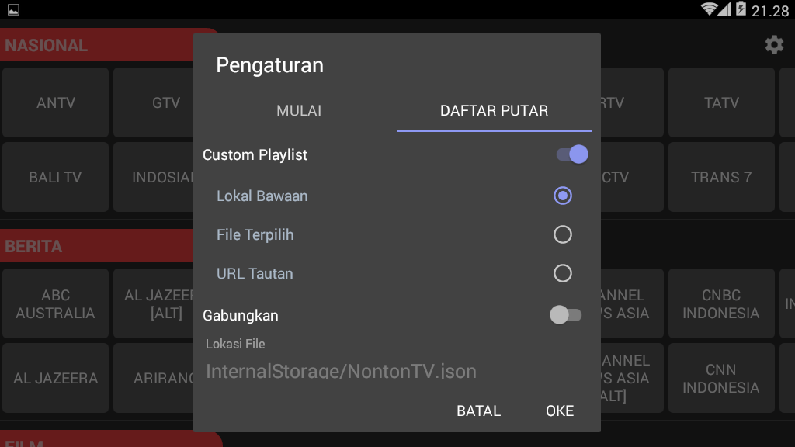
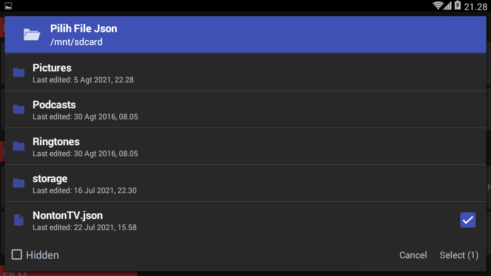
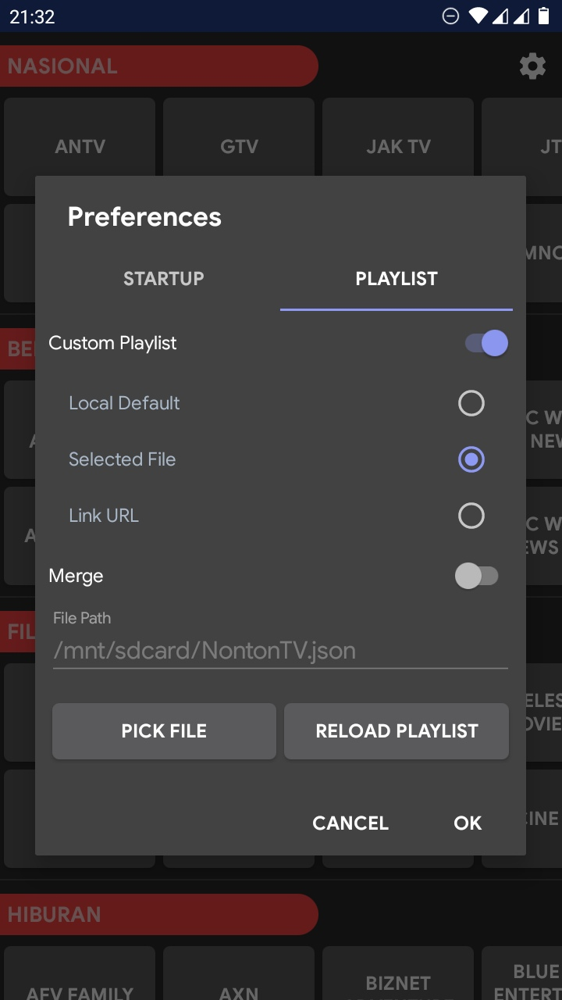

# NontonTV

Nonton siaran televisi dimana aja dan kapan aja, asalkan kuota banyak & internet kenceng. Cocok untuk dipasang ke android stb/box. Aplikasi bisa download [disini](https://github.com/hariimurti/NontonTV/releases).

## Peringatan Keras
**HARAP MENCANTUMKAN CREDIT, BILA MANA ANDA MAU MENGEDIT/MEMPUBLISH APLIKASI INI DENGAN NAMA LAIN!!!**

## Fitur
- tidak perlu langganan
- bebas iklan, bebas dari tracking, apk kecil
- tampilan simpel, tdk butuh banyak interaksi
- otomatis mencoba putar kembali jika tayangan putus/error
- bisa pilih kualitas video, audio, maupun subtitle (bila tayangan mendukung)
- support screen mode : fit, fill, zoom, fixed witdh, fixed height
- support picture-to-picture
- support dpad
- jalankan aplikasi saat booting
- otomatis putar terakhir dilihat saat menjalankan aplikasi
- support playlist kustom (lokal, maupun tautan)
- dan lain-lain

## Navigasi Player
- DPAD LEFF, MEDIA PREVIOUS, SWIPE RIGHT = channel sebelumnya
- DPAD RIGHT, MEDIA NEXT, SWIPE LEFT = channel selanjutnya
- DPAD UP, PAGE UP, SWIPE DOWN = kategori sebelumnya
- DPAD DOWN, PAGE DOWN, SWIPE UP = kategori selanjutnya
- DPAD CENTER, MENU = buka pengaturan

## Screenshots

## Thanks to
- [iptv.org](https://github.com/iptv-org/iptv)
- [fluxustv](https://fluxustv.blogspot.com/)
- [contributors](../../graphs/contributors)
- [user grup](https://t.me/paijemdev)
- dan lain-lain

## Notes
- *bantu mengupdate siaran [NontonTV.json](../../blob/playlist/NontonTV.json)*
