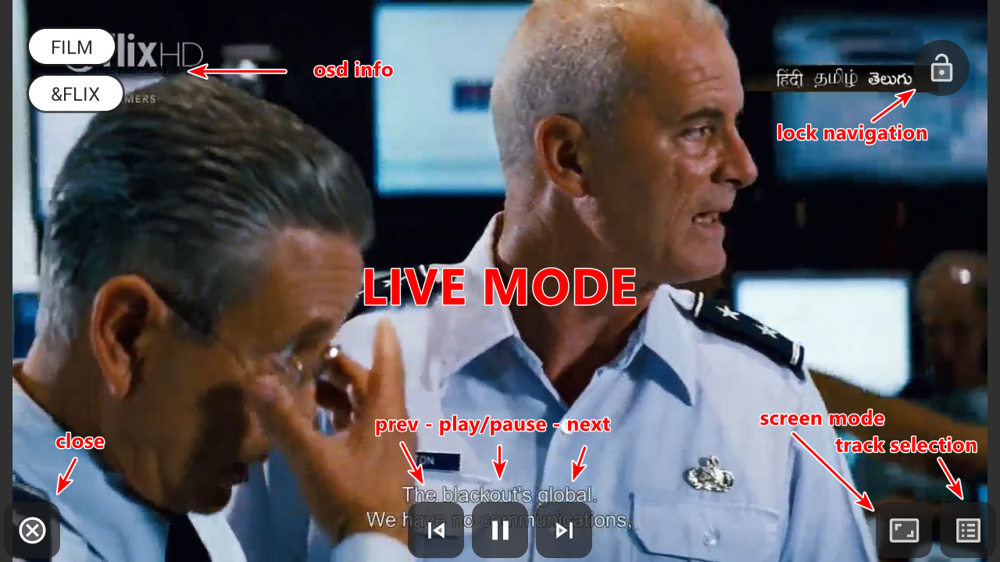
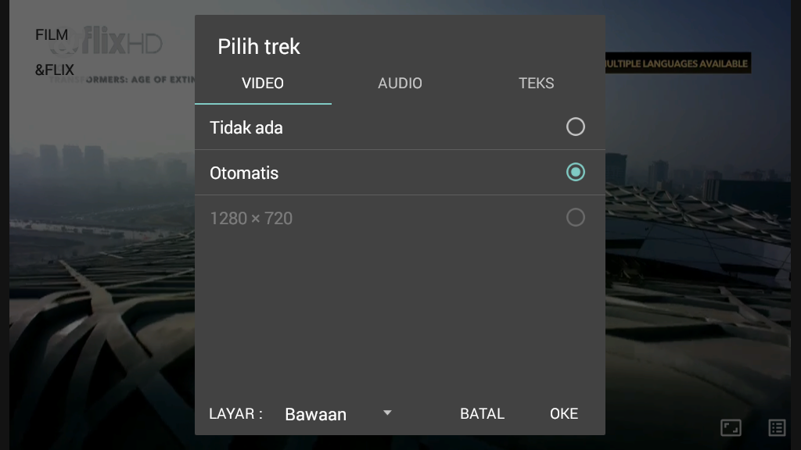
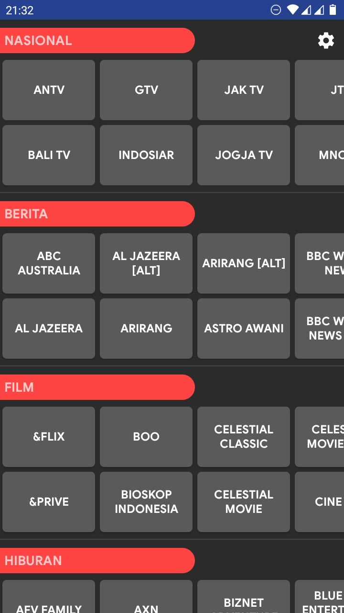
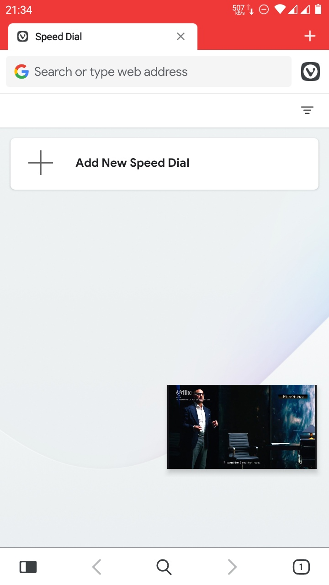
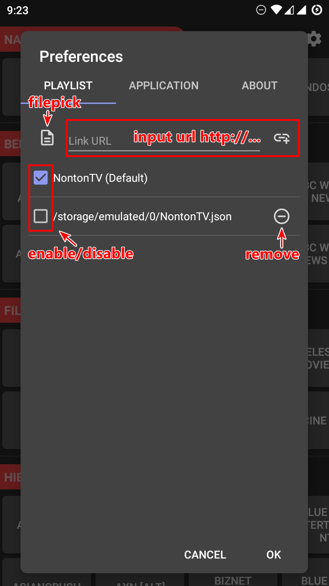
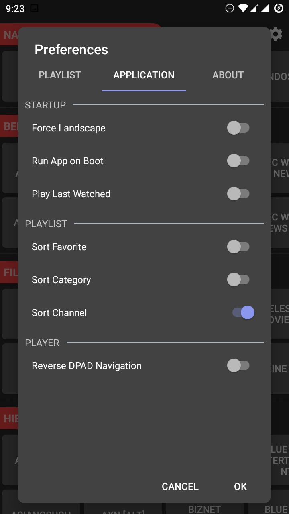

# NontonTV

Nonton siaran televisi dimana aja dan kapan aja, asalkan kuota banyak & internet kenceng. Cocok untuk dipasang ke android stb/box. Aplikasi bisa diunduh [disini](https://github.com/hariimurti/NontonTV/releases).

# PERINGATAN & LARANGAN
# DILARANG MEMPERJUAL-BELIKAN SOURCE-CODE/APLIKASI INI!!!
# HARAP MENCANTUMKAN CREDIT, BILA MANA ANDA MAU MENGEDIT/MEMPUBLISH APLIKASI INI DENGAN NAMA LAIN!!!

## Fitur
- tidak perlu langganan
- bebas iklan, bebas dari tracking, apk relatif kecil
- tampilan simpel, tdk butuh banyak interaksi
- otomatis mencoba putar kembali jika tayangan putus/error
- pin/unpin saluran favorit (pencet saluran agak lama)
- bisa pilih kualitas video, audio, maupun subtitle (bila tayangan mendukung)
- support screen mode : fit, fill, zoom, fixed witdh, fixed height
- support picture-to-picture
- support remote dpad
- support playlist json (nontontv) & m3u biasa
- support playlist kustom (lokal, maupun tautan)
- support protocol rtmp
- jalankan aplikasi saat booting
- otomatis putar terakhir dilihat saat menjalankan aplikasi
- dan lain-lain

## Navigasi Player
- DPAD PLAY-PAUSE = play / pause channel
- DPAD REWIND-FORWARD = seek back / forward
- DPAD LEFF, MEDIA PREVIOUS, SWIPE RIGHT = channel sebelumnya
- DPAD RIGHT, MEDIA NEXT, SWIPE LEFT = channel selanjutnya
- DPAD UP, PAGE UP, SWIPE DOWN = kategori sebelumnya
- DPAD DOWN, PAGE DOWN, SWIPE UP = kategori selanjutnya
- DPAD MENU = buka pengaturan
- DPAD CENTER = tampilkan kontrol player

## Screenshots

## Thanks to
- [iptv.org](https://github.com/iptv-org/iptv)
- [contributors](../../graphs/contributors)
- [user grup](https://t.me/paijemdev)
- dan lain-lain
