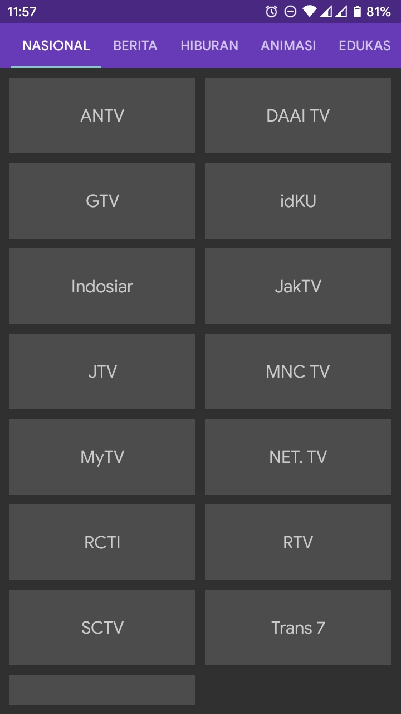
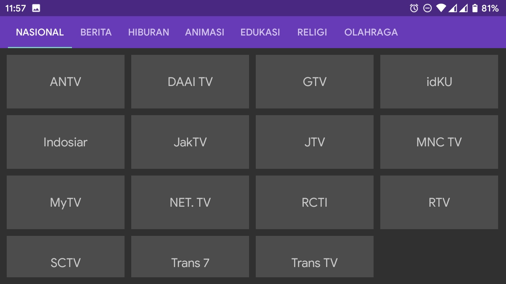
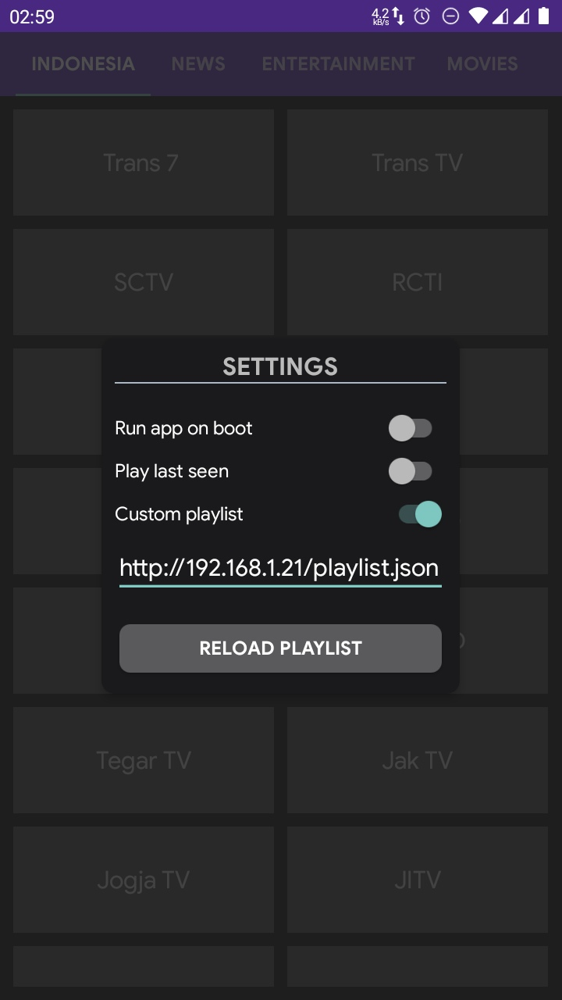
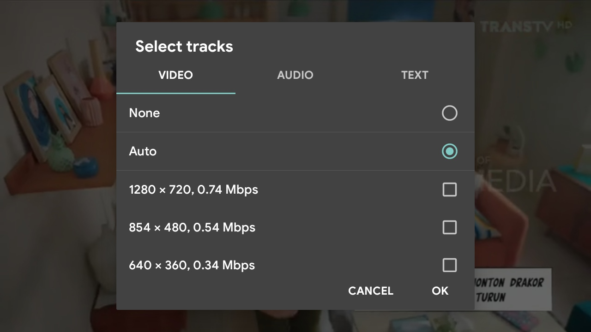

# NontonTV

Nonton siaran televisi dimana aja dan kapan aja, asalkan kuota banyak & internet kenceng. Cocok untuk dipasang ke android stb/box. Aplikasi bisa download [disini](https://github.com/hariimurti/NontonTV/releases).

## Peringatan Keras
**HARAP MENCANTUMKAN CREDIT, BILA MANA ANDA MAU MENGEDIT/MEMPUBLISH APLIKASI INI DENGAN NAMA LAIN!!!**

## Fitur
- tidak perlu langganan
- bebas iklan, bebas dari tracking, apk kecil
- tampilan simpel, tdk butuh banyak interaksi
- otomatis mencoba putar kembali jika tayangan putus/error
- bisa pilih kualitas video, audio, maupun subtitle (bila tayangan mendukung)
- [pengaturan] jalankan aplikasi saat booting
- [pengaturan] otomatis putar terakhir dilihat saat menjalankan aplikasi
- [pengaturan] support playlist kustom
- dan lain-lain

## Bugs
- untuk navigasi remote tv kadang agak susah, bisa gunakan [apk ini](https://play.google.com/store/apps/details?id=io.appground.blek&hl=en&gl=US)

## Screenshots

## Thanks to
- [iptv.org](https://github.com/iptv-org/iptv)
- [exodiver](https://github.com/exodiver/IPTV)
- [fluxustv](https://fluxustv.blogspot.com/)
- dan lain-lain

## Notes
- *untuk akses **pengaturan** gunakan tombol recent (tekan lama) di hp maupun remote.*
- *playlist kustom: isikan tautan ke file json, atau biarkan kosong maka akan membaca file [NontonTV.json](./json/playlist.json) dari penyimpanan internal (pastikan anda telah mengcopykan file tersebut).*
- *bantu mengupdate [siaran ini](./json/playlist.json), menggunakan soft [iptv.manager](https://github.com/hariimurti/NontonTV/releases/download/v1.4/IPTV.Manager_v2021.5.14.2327.zip).*
